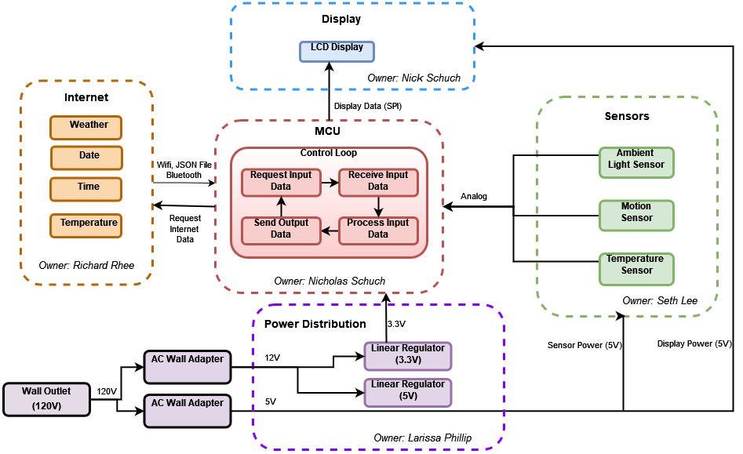

# Looking Glass - Introduction
This is a smart mirror project for senior design at Purdue University\
The goal was to create a device that would save time in the morning by providing useful information on the mirror such as time, date, weather, notifications, news articles, etc.

## Features
1. Displays the time, date, and daily weather forecast
2. Activated either by walking in front of the device or pressing a button
3. Has a low power mode where the display dims and the sensors poll at a slower rate to save energy consumption

## System Design
